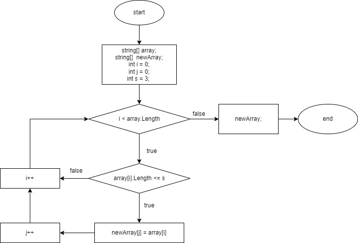

## Итоговая работа 

**Задача** 
Написать программу, которая из имеющегося массива строк формирует новый массив из строк, длина которых меньше, либо равна 3 символам. Первоначальный массив можно ввести с клавиатуры, либо задать на старте выполнения алгоритма. При решении не рекомендуется пользоваться коллекциями, лучше обойтись исключительно массивами.

*Примеры:*

[“Hello”, “2”, “world”, “:-)”] → [“2”, “:-)”]

[“1234”, “1567”, “-2”, “computer science”] → [“-2”]

[“Russia”, “Denmark”, “Kazan”] → []

## *Описание процесса*

- создаем исходный массив
- Создаем цикл на перебор значение массива на соответсвтуя условия _**длинна <= 3**_  до тех пор покане достигнем конца исходного массива
- если строка выполняет условие, кладем значение в новый массив
- возвращаем заполненный массив result

## Блок схема

 